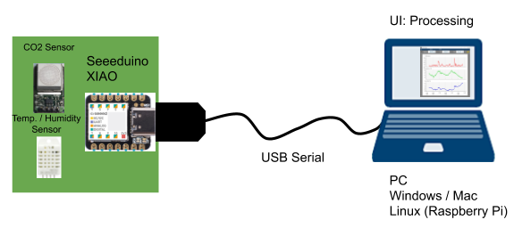
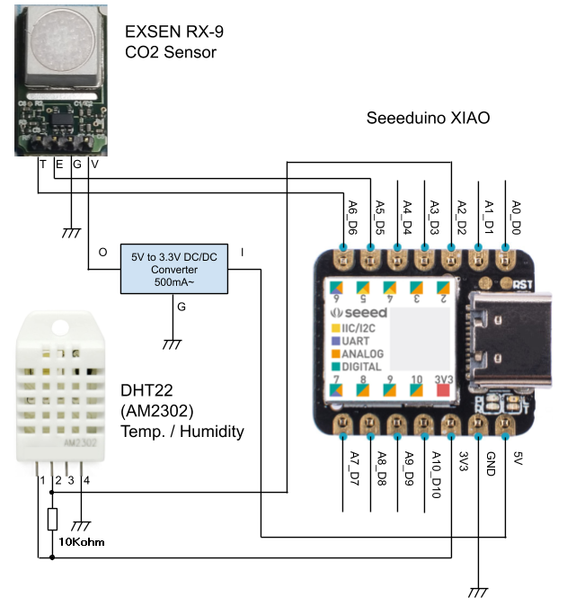
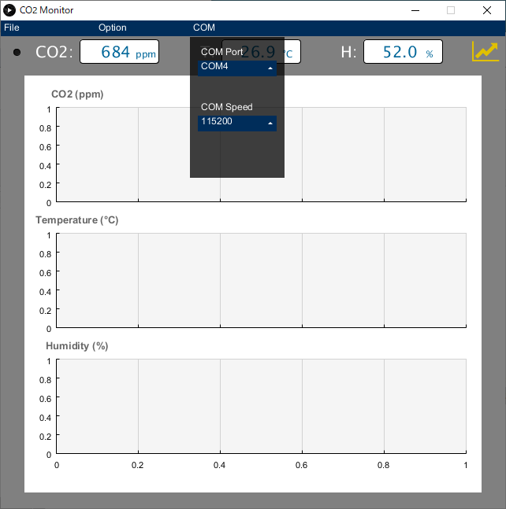

# Seeeduino XIAO CO2 Monitor (Arduino Sketch & Processing Sketch)
## System Diagram


## BOM
| No. | Item | Note |
----|----|---- 
| 1 | Seeed / Seeeduino XIAO | Arduino Microcontroller |
| 2 | EXSEN / RX-9 | Solid Electrochemical CO2 Sensor |
| 3 | DHT22 (AM2302) | Temperature / Humidity Sensor |
| 4 | 5V to 3.3V Step Down DC/DC with output current capacity 500mA~ | 3.3V power supply for RX-9 |
| 5 | 10Kohm | DHT22 pull up |

Since RX-9 could consume 242mA (max) current during warming up, 3.3V power for RX-9 must be separated from Seeeduino XIAO's 3.3V.

## Circuit Diagram


## Pin Assignment
| Definition | Arduino Pin No. | Attribute | Connected with |
----|----|----|---- 
| DHTPIN | 2 | Digital In | DHT22 Pin2 |
| EMF_pin | 5 | Analog In | RX-9 ETF |
| THER_pin | 6 | Analog In | RX-9 THER |

## Arduino sketch
### Boards Manager setup for Seeeduino XIAO
See [Getting Started](https://wiki.seeedstudio.com/Seeeduino-XIAO/#getting-started) of Seeeduino XIAO

### DHT22 Library
Install 'DHT-sensor-library by Adafruit' from Library Manager of Arduino

### CO2 Sensor (EXSEN RX-9) Library codes
[RX9QR.cpp]: https://github.com/EXSEN/RX-9/blob/23602bf8d59dcdc47213648cf599053340d8f5d7/RX-9_QR_Header/RX9QR.cpp
[RX9QR.h]: https://github.com/EXSEN/RX-9/blob/23602bf8d59dcdc47213648cf599053340d8f5d7/RX-9_QR_Header/RX9QR.h
Bring [RX9QR.cpp][RX9QR.cpp] and [RX9QR.h][RX9QR.h] from the GitHub repository of EXSEN and  
put them on 'arduino_Seeeduino_XIAO_RX9QR_DHT22/' direcotry.

### Build & Upload the sketch
Build 'arduino_Seeeduino_XIAO_RX9QR_DHT22/arduino_Seeeduino_XIAO_RX9QR_DHT22.ino' and upload to Seeeduino XIAO.

### Calibration for RX-9 Sensor
If the sketch is correctly uploaded, Seeeduino XIAO starts to output in '[Serial Monitor Output Format](README.md#serial-monitor-output-format)' manner.
Then, scan QR code on the back plate of RX-9 module and send the 21 or 22 charactor string through Serial terminal.
```
calib 15742214167K0544CAB07A
```
The calibration parameters are stored to Flash Memory in Seeeduino XIAO and they will be reflected from the next boot.  
Please note that every time when the sketch image is uploaded, you need to set the calibration parameters again because they have been cleared to the default values.

## Processing sketch
Processing Sketch is in 'arduino_Seeeduino_XIAO_RX9QR_DHT22' directory.
### Install Processing
Download and install [Processing](https://processing.org/download/) for your host side platform

### Install Libraries
From Sketch -> Import Library
- Install ControlP5
- Install grafica

See Library Reference from Help -> Library Reference of Processing.

### Download fontawesome-webfont.ttf
Download [fontawesome-webfont.ttf](https://github.com/beakerbrowser/beakerbrowser.com/blob/0aeb4ebc03fee69553d6c8b00180b5ec6c8d79f5/fonts/fontawesome-webfont.ttf) and put it on 'processing_CO2monitor/' directory.
It seems like fontawesome-webfont.ttf has several versions. In case that you cannot download from above link, you can try another one.

### Execute Sketch
Connect Seeduino XIAO with the sketch uploaded to USB connector and execute 'processing_CO2monitor/processing_CO2monitor.pde'.  
At the first launch of the sketch, select COM port number from the COM Menu.  


Once the execution is succeeded, you can migrate to the different platform by the function of 'Export as Application' from File Menu of Processing. In that case, put 'fontawesome-webfont.ttf' manually under the new application directory (application.xxxx).

## Appendix

### Serial Monitor Output Format
CO2/Temp/Humi values are sent every 1 second in following format.

    # C:452 T:27.80 H:52.40

- C: CO2 (ppm)  (432 ~ 6000)
- T: Temperature (Celsius deg.) (can be - minus value)
- H: Humidity (%) (0.0 ~ 100.0)

Number of digit of each value is not fixed.  
If the calculated value is NOT valid number, "xxxx" is shown.  
(while CO2 sensor warming up / in case of DHT22 sensor's float NaN Error)  

Select corresponding COM port number from the serial terminal software on host (PC) side.  
Since Serial COM of Seeeduino XIAO is done by USB CDC, it's free from Serial Speed (Baudrate) setting.

### Serial Command Reference

    reset: Reset System
    reboot: Same as reset
    enable_monitor: Enable CO2/Temp/Humi Serial Monitor Output
    disable_monitor: Disable CO2/Temp/Humi Serial Monitor Output
    enable_echoback: Enable Serial Command Echo Back
    disable_echoback: Disable Serial Command Echo Back
    calib 15742214167K0544CAB07A: Store calibration parameters for RX-9 by QR code string (22 or 21 charactors)
    
(Ignore case)

